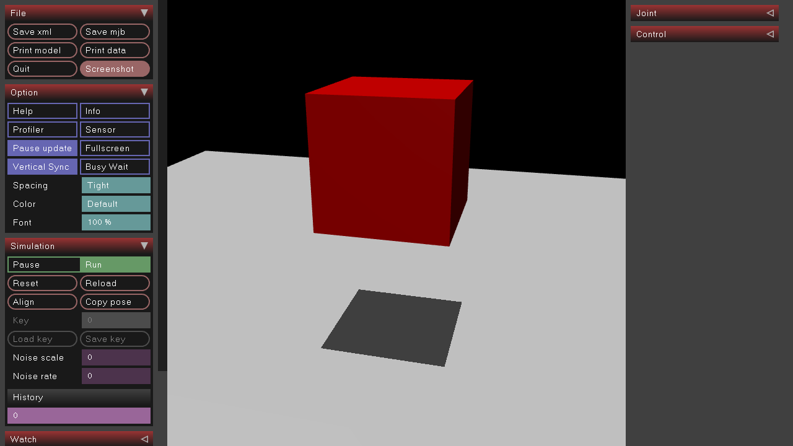
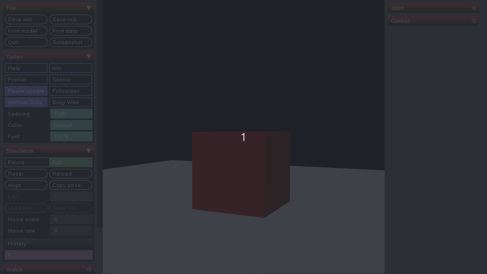
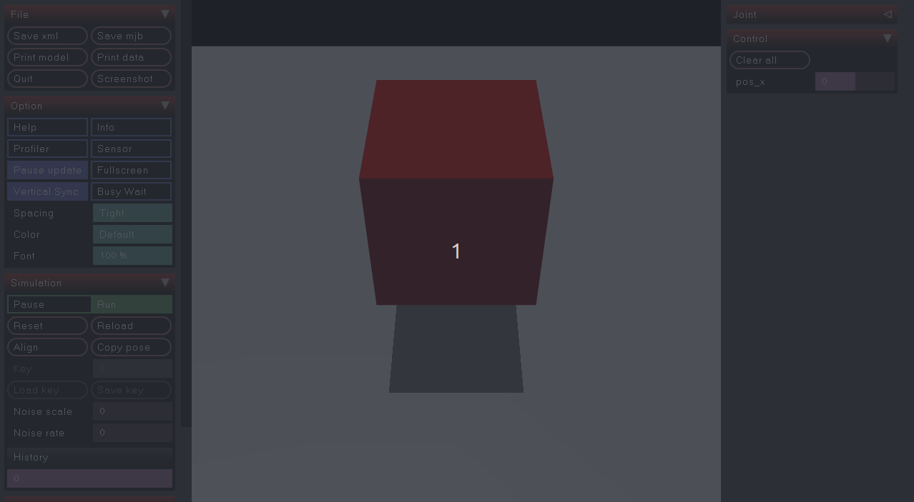
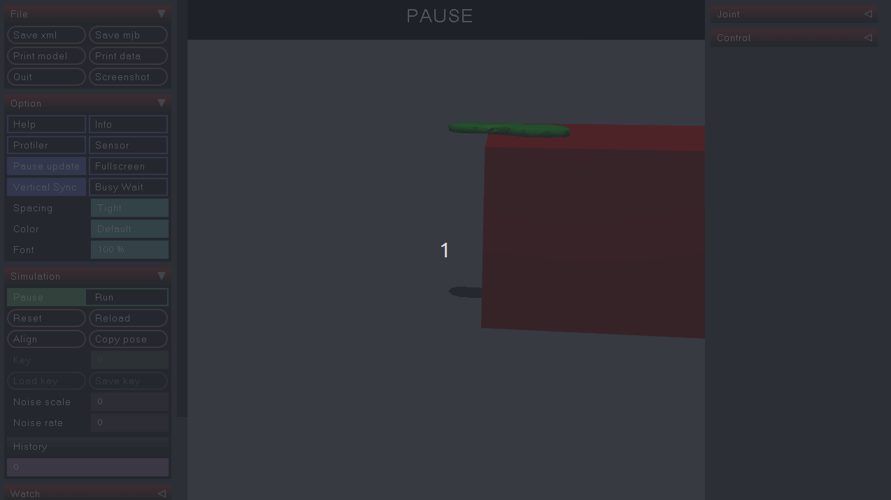

# MuJoCo Playground

**_MuJoCo Version:_** 3.1.6\
**_Python Version:_** 3.11.9\
**_OS:_** Ubuntu 22.04.4 x86_64

Some painful learning experiences, I hope that helps a bit :).
More details see [official MuJoCo Documentation](https://mujoco.readthedocs.io/en/stable/python.html#).

## Preparation

```bash
conda env create -f environment.yml
conda activate mj
```

## Build Your Model

### Getting Start with MJCF

Let's start with a simple example

```xml
<mujoco>
	<worldbody>
		<light diffuse=".5 .5 .5" pos="0 0 5" directional="true" dir="0 0 -1" />
		<geom name="floor" type="plane" size="10 10 10" pos="0 0 0" rgba="1 1 1 1" />
		<body>
			<geom name="cube" type="box" size="1 1 1" pos="0 0 3" rgba="1 0 0 1" />
		</body>
	</worldbody>
</mujoco>
```

- [<u>\<mujoco>...\</mujoco></u>](https://mujoco.readthedocs.io/en/stable/XMLreference.html#mujoco): The unique top-level element, identifying the XML file as an MJCF model file. Every MJCF has to have this tag as root.
- [<u>\<worldbody>...\</worldbody></u>](https://mujoco.readthedocs.io/en/stable/XMLreference.html#world-body-r): Used for the top-level body, parent of all other bodies. _It cannot have child elements **inertial** and **joint**, and also cannot have any attributes._
  - [<u>\<body>...\</body></u>](https://mujoco.readthedocs.io/en/stable/XMLreference.html#world-body-r): other bodies.
    - [<u>\<geom>...\</geom></u>](https://mujoco.readthedocs.io/en/stable/XMLreference.html#body-geom): Element of a body, creates a geom, and attaches it rigidly to the body within which the geom is defined. Available types: plane, hfield, sphere, capsule, ellipsoid, cylinder, box, mesh, sdf.

Drag this xml file into simulation, you should get the following model:


### Make your body move

To make your body movable, you have to create a joint element. Joint creates motion degrees of freedom between the body where it is defined and the body’s parent.

In MuJoCo there are 4 different types of joint: **free, ball, slide** and **hinge**.

- The free joint has three translational degrees of freedom followed by three rotational degrees of freedom. In other words it makes the body floating.
- The ball type creates a ball joint with three rotational degrees of freedom. The rotation is represented as a unit quaternion.
- The slide type creates a sliding or prismatic joint with one translational degree of freedom.
- The hinge type creates a hinge joint with one rotational degree of freedom.

Example: add a free joint to the cube in previous example

```XML
<mujoco>
	<worldbody>
		<light diffuse=".5 .5 .5" pos="0 0 5" directional="true" dir="0 0 -1" />
		<geom name="floor" type="plane" size="10 10 10" pos="0 0 0" rgba="1 1 1 1" />
		<body>
      <joint type="free" />
      <!-- <freejoint /> works the same way -->
			<geom name="cube" type="box" size="1 1 1" pos="0 0 3" rgba="1 0 0 1" />
		</body>
	</worldbody>
</mujoco>
```



### Control your body

To Control your body, you need to define the \<actuator>\</actuator> tag. Actuators in MuJoCo are used to apply forces, torques, or control inputs to the joints in your model.

Here we have a slide joint allowing motion along the x-axis, and a positional actuator attached to the slide joint.

```xml
<mujoco>
	<worldbody>
		<light diffuse=".5 .5 .5" pos="0 0 5" directional="true" dir="0 0 -1" />
		<geom name="floor" type="plane" size="10 10 10" pos="0 0 0" rgba="1 1 1 1" />
		<body>
      <inertial mass="1" pos="0 0 3" diaginertia="1e-3 1e-3 1e-3"/>
      <joint name="slider" pos="0 0 3" type="slide" axis="1 0 0" range="-5 5" damping="0"/>
			<geom name="cube" type="box" size="1 1 1" pos="0 0 3" rgba="1 0 0 1" />
		</body>
	</worldbody>
    <actuator>
        <position name="pos_x" joint="slider" ctrlrange="-.5 .5" forcerange="10 10" kp="10"/>
    </actuator>
</mujoco>
```



### Create a deformable object

There are 2 ways to create your deformable object.

- Using deformable/flex (not involved here, see [official documentation](https://mujoco.readthedocs.io/en/stable/XMLreference.html#deformable-flex))
- Using [(world)body/flexcomp](https://mujoco.readthedocs.io/en/stable/XMLreference.html#body-flexcomp)

Here is the example of creating a deformable insole from tetrahedral mesh.
MuJoCo offers a range of [plugins](https://github.com/google-deepmind/mujoco/tree/main/plugin/elasticity) for deformable objects, allowing users to set the physical parameters of the objects.
**Note:** The solid plugin only supports tetrahedral meshes in .gmsh format, and MuJoCo only supports reading tetrahedral meshes in .gmsh format. If your mesh is in .stl, .obj, or other triangular mesh formats, please use the membrane plugin or convert your mesh file to a tetrahedral mesh using [GMSH software](https://gmsh.info/).

```xml
<mujoco>
	<extension>
		<plugin plugin="mujoco.elasticity.solid" />
	</extension>
	<worldbody>
		<light pos="0.3 0 1.5" dir="0 0 -1" directional="true" />
		<geom name="floor" pos="0 0 0" size="0 0 0.05" type="plane" />
		<geom name="platform" pos=".65 0 .15" size=".4 .2 .3" type="box" rgba="1 0 0 1" />
		<body name="insole_fixed" pos=".3 -.05 .456">
			<flexcomp name="insole" mass=".5" dim="3" type="gmsh" file="insole.msh" rgba=".1 .9 .1 1">
				<edge equality="true" />
				<plugin plugin="mujoco.elasticity.solid">
					<config key="young" value="8e4" />
					<config key="poisson" value="0.2" />
					<config key="damping" value=".0001" />
				</plugin>
			</flexcomp>
		</body>
	</worldbody>
</mujoco>

```



### Convert URDF to MJCF

MuJoCo is able to load Model from URDF directly, or you can use the built-in compiler to create a new MJCF from URDF. The compile binary is typically located in the bin directory of your MuJoCo installation.
**NOTE: If some parts of your model are depended on meshes, you have to use the [URDF extensions](https://mujoco.readthedocs.io/en/stable/modeling.html#curdf)**

Run the command and you will get a MJCF.

```bash
path/to/mujoco/bin/compile  your_urdf.urdf  your_mjcf.xml
```

## Python Binding

### Some important data in `MjModel` (see more [here](https://mujoco.readthedocs.io/en/stable/APIreference/APItypes.html#mjmodel))

|             Name              | Meaning                           | Value/Size |
| :---------------------------: | --------------------------------- | :--------: |
|         `MjModel.nq`          | number of generalized coordinates | dim(qpos)  |
|         `MjModel.nv`          | number of degrees of freedom      | dim(qvel)  |
|        `MjModel.ngeom`        | number of geoms                   |   ngeom    |
|        `MjModel.nbody`        | number of bodies                  |   nbody    |
|        `MjModel.njnt`         | number of joints                  |    njnt    |
|         `MjModel.nu`          | number of actuators/controls      | dim(ctrl)  |
| `MjMOdel.actuator_ctrlrange`  | range of controls                 |  (nu x 2)  |
| `MjMOdel.actuator_forcerange` | range of forces                   |  (nu x 2)  |

You can access a specific body frame for by calling `MjModel.body(id: int)` or `MjModel.body(name: str)` it will return a `_MjModelBodyViews` which contains following information:

```
<_MjModelBodyViews
  dofadr: array([0], dtype=int32)
  dofnum: array([1], dtype=int32)
  geomadr: array([4], dtype=int32)
  geomnum: array([6], dtype=int32)
  id: 2
  inertia: array([6.40e-05, 4.38e-05, 3.50e-05])
  invweight0: array([3.16603215e-02, 3.76460422e+01])
  ipos: array([0.   , 0.   , 0.029])
  iquat: array([0.5, 0.5, 0.5, 0.5])
  jntadr: array([0], dtype=int32)
  jntnum: array([1], dtype=int32)
  mass: array([0.1])
  mocapid: array([-1], dtype=int32)
  name: 'lh_wrist'
  parentid: array([1], dtype=int32)
  pos: array([0.01   , 0.     , 0.21301])
  quat: array([0.70710678, 0.        , 0.        , 0.70710678])
  rootid: array([1], dtype=int32)
  sameframe: array([0], dtype=uint8)
  simple: array([0], dtype=uint8)
  subtreemass: array([0.794])
  user: array([], dtype=float64)
  weldid: array([2], dtype=int32)
>
```

You can access any other view of MjObj type by calling `MjModel.geom()` `MjModel.sensor()` `MjModel.key()` etc..

### Some important data in `MjData` (see more [here](https://mujoco.readthedocs.io/en/stable/APIreference/APItypes.html#mjdata))

|         Name          | Meaning                             |    Size     |
| :-------------------: | ----------------------------------- | :---------: |
|     `MjData.qpos`     | Position                            |  (nq x 1)   |
|     `MjData.qvel`     | Velocity                            |  (nv x 1)   |
|     `MjData.xpos`     | Cartesian position of body frame    | (nbody x 3) |
|    `MjData.xipos`     | Cartesian position of body com      | (nbody x 3) |
|     `MjData.xmat`     | Cartesian orientation of body frame | (nbody x 9) |
|  `MjData.geom_xpos`   | Cartesian geom position             | (ngeom x 3) |
|   `MjData.geom_mat`   | Cartesian geom orientation          | (ngeom x 9) |
|     `MjData.ctrl`     | External control (action)           |  (nu x 1)   |
| `MjData.qfrc_applied` | Applied generalized force           |  (nv x 1)   |
| `MjData.xfrc_applied` | Applied Cartesian force/torque      | (nbody x 6) |

**Flex Object information**
| Name | Meaning | Size |
| :-------------------: | ----------------------------------- | :---------: |
| `MjData.flexvert_xpos` | Cartesian flex vertex positions | (nflexvert x 3) |
| `MjData.flexelem_aabb` | flex element bounding boxes (center, size) | (nflexelem x 6) |
| `MjData.flexedge_J` | flex edge Jacobian | (nflexedge x nv) |
| `MjData.flexedge_length` | flex edge Jacobian | (nbody x 9) |
| `MjData.flexedge_velocity` | flex edge lengths | (nflexedge x 1) |

Same as MjModel, you can get a `_MjDataBodyViews` by calling `MjData.body(id: int)` or `MjData.body(name: str)`

```
<_MjDataBodyViews
  cacc: array([0., 0., 0., 0., 0., 0.])
  cfrc_ext: array([0., 0., 0., 0., 0., 0.])
  cfrc_int: array([0., 0., 0., 0., 0., 0.])
  cinert: array([0., 0., 0., 0., 0., 0., 0., 0., 0., 0.])
  crb: array([0., 0., 0., 0., 0., 0., 0., 0., 0., 0.])
  cvel: array([0., 0., 0., 0., 0., 0.])
  id: 2
  name: 'lh_wrist'
  subtree_angmom: array([0., 0., 0.])
  subtree_com: array([0., 0., 0.])
  subtree_linvel: array([0., 0., 0.])
  xfrc_applied: array([0., 0., 0., 0., 0., 0.])
  ximat: array([0., 0., 0., 0., 0., 0., 0., 0., 0.])
  xipos: array([0., 0., 0.])
  xmat: array([0., 0., 0., 0., 0., 0., 0., 0., 0.])
  xpos: array([0., 0., 0.])
  xquat: array([0., 0., 0., 0.])
>
```

### Some Useful APIs

- **Static factory functions that create a new `mujoco.MjModel` instance**

  - `mujoco.MjModel.from_xml_path(path)`: create from a xml file
  - `mujoco.MjModel.from_xml_string(xml_string)`: create from a xml string

- **[Functions](https://mujoco.readthedocs.io/en/latest/APIreference/APIfunctions.html#)**
  - `mujoco.mj_reset_data(model, data)`: Reset data to defaults.
  - `mujoco.mj_step(model, data)`: Advance simulation.
  - `mujoco.mj_forward(model, data)` : Compute forward kinematic without integrating in time.
  - `mujoco.mju_str2Type(str)`: Convert [mjtObj](https://mujoco.readthedocs.io/en/latest/APIreference/APItypes.html#mjtobj) type name to type id
  Available name strings for MuJoCo 3.1.6 are: **"body", "xbody", "joint", "dof", "geom", "site", "camera", "light", "flex", "mesh", "skin", "hfield", "texture", "material", "pair", "exclude", "equality", "tendon", "actuator", "sensor", "numeric", "text", "tuple", "key", "plugin"**
  - `mujoco.mj_id2name(model, type, id)`: Get name of object with the specified mjtObj type (**int**) and id, returns None if name not found.
  - `mujoco.mj_name2id(model, type, name)`: Get id of object with the specified mjtObj type (**int**) and name, returns -1 if id not found.
  - `mujoco.mju_euler2Quat(quat, euler, seq)`: Convert sequence of Euler angles (radians) to quaternion. seq[0,1,2] must be in 'xyzXYZ', lower/upper-case mean intrinsic/extrinsic rotations.
- **Passive `mujoco.viewer`**
  - The `mujoco.viewer.launch_passive(model, data, *, key_callback=None,show_left_ui=True, show_right_ui=True)` returns a handle which can be used to interact with the viewer. It can be used as a context manager.
  - Arguments:
    - **model:** MjModel instance.
    - **data:** MjData.
    - **key_callback:** A callable which gets called each time a keyboard event occurs in the viewer window e.g. pause the movement (see example above)
    - **show_left_ui:** if show left ui.
    - **show_right_ui:** if show right ui.
  - Attributes (incomplete):
    - `viewer.is_running()`: check if viewer window is still running.
    - `viewer.sync()`: update MjModel and MjData, render the model after a physic step.(call after `mujoco.mj_step()`)
    - `viewer.close()`: call after you are done with the viewer, if you do not use the viewer as a context manager.
    - `cam`, `opt`, and `pert` properties: correspond to `mjvCamera`, `mjvOption`, and `mjvPerturb` structs, respectively.
